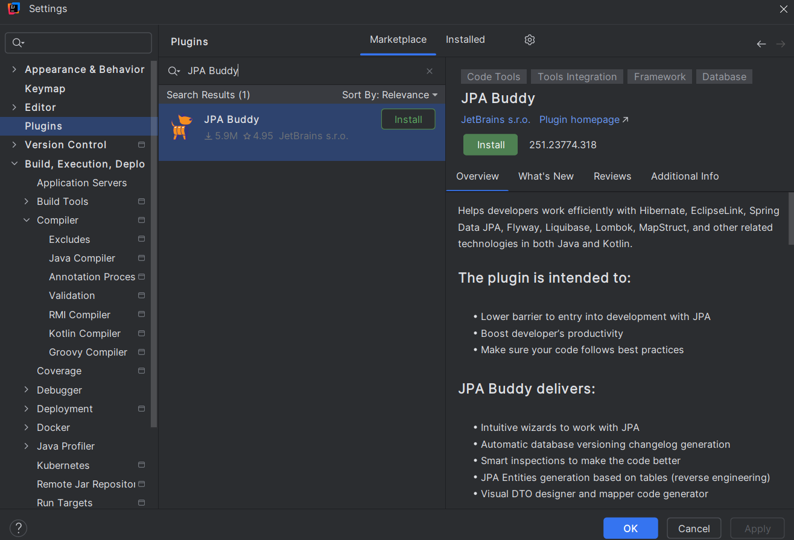

###
spring.jpa.hibernate.ddl-auto=update -> Tạo database từ pojo

###
Nhớ lấy mapstruct lấy riêng trên maven 

mapstruct - processor -> thêm ở cofi chứ không phải dependencies

<!-- https://mvnrepository.com/artifact/org.mapstruct/mapstruct-processor -->
<dependency>
    <groupId>org.mapstruct</groupId>
    <artifactId>mapstruct-processor</artifactId>
    <version>1.6.3</version>
</dependency>

//Mapstruct core -> mapper dto.request vào pojo(entity) thay vì map thủ công 

<!-- https://mvnrepository.com/artifact/org.mapstruct/mapstruct -->
<dependency>
    <groupId>org.mapstruct</groupId>
    <artifactId>mapstruct</artifactId>
    <version>1.6.3</version>
</dependency>

lombok-mapstruct-binding  -> thêm ở cofi chứ không phải dependencies

<!-- https://mvnrepository.com/artifact/org.projectlombok/lombok-mapstruct-binding -->
<dependency>
    <groupId>org.projectlombok</groupId>
    <artifactId>lombok-mapstruct-binding</artifactId>
    <version>0.2.0</version>
</dependency>

//Bật pluglin lombok trong IDE 
//Bật enable (Annotation processors)

### 
Không dùng Autowired dùng 
@RequiredArgsConstructor // constructor final
@FieldDefaults(level = AccessLevel.PRIVATE , makeFinal = true) // private final

<h2>Grenated sql code </h2> 

JPA Buddy 

#Refesh token -> de luu trang thai dang nhap (vi token co the het han) -> tang than thien voi nguoi dung