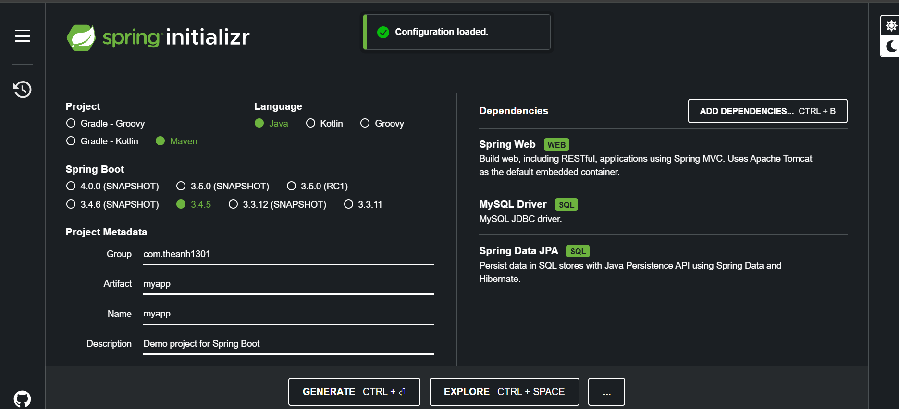

###
spring.jpa.hibernate.ddl-auto=update -> Tạo database từ pojo

###
Nhớ lấy mapstruct lấy riêng trên maven 

mapstruct - processor

<!-- https://mvnrepository.com/artifact/org.mapstruct/mapstruct-processor -->
<dependency>
    <groupId>org.mapstruct</groupId>
    <artifactId>mapstruct-processor</artifactId>
    <version>1.6.3</version>
</dependency>

lombok-mapstruct-binding

<!-- https://mvnrepository.com/artifact/org.projectlombok/lombok-mapstruct-binding -->
<dependency>
    <groupId>org.projectlombok</groupId>
    <artifactId>lombok-mapstruct-binding</artifactId>
    <version>0.2.0</version>
</dependency>

//Bật pluglin lombok trong IDE 
//Bật enable (Annotation processors)