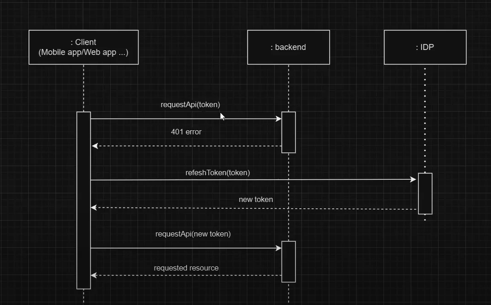

###
spring.jpa.hibernate.ddl-auto=update -> Tạo database từ pojo


###
Nhớ lấy mapstruct lấy riêng trên maven 

mapstruct - processor -> thêm ở cofi chứ không phải dependencies


<!-- https://mvnrepository.com/artifact/org.mapstruct/mapstruct-processor -->
<dependency>
    <groupId>org.mapstruct</groupId>
    <artifactId>mapstruct-processor</artifactId>
    <version>1.6.3</version>
</dependency>

//Mapstruct core -> mapper dto.request vào pojo(entity) thay vì map thủ công 

<!-- https://mvnrepository.com/artifact/org.mapstruct/mapstruct -->
<dependency>
    <groupId>org.mapstruct</groupId>
    <artifactId>mapstruct</artifactId>
    <version>1.6.3</version>
</dependency>

lombok-mapstruct-binding  -> thêm ở cofi chứ không phải dependencies

<!-- https://mvnrepository.com/artifact/org.projectlombok/lombok-mapstruct-binding -->
<dependency>
    <groupId>org.projectlombok</groupId>
    <artifactId>lombok-mapstruct-binding</artifactId>
    <version>0.2.0</version>
</dependency>

//Bật pluglin lombok trong IDE 
//Bật enable (Annotation processors)


### 
Không dùng Autowired dùng 
@RequiredArgsConstructor // constructor final
@FieldDefaults(level = AccessLevel.PRIVATE , makeFinal = true) // private final


<h2>Grenated sql code </h2> 

JPA Buddy 


#Refesh token -> de luu trang thai dang nhap (vi token co the het han) -> tang than thien voi nguoi dung




#Build thu cong (build bang java) 
```
java --version

-truoc do phai ./mvnw clean -> de  xoa target

./mvnw package -DskipTests -> tao ra file .jar  0.0.1.SNAPSHOT la phien ban

```
- mo cmd chua file jar :  java -jar .\ten file jar -> spring boot da chay Ctrl C de tat
- co the dem file jar qua may khac chay binh thuong

#Build bang maven (cai apache maven)

```
- mvn --version
- mvn clean
- mvn package -DskipTests
```


#Build voi docker


Docker desktop 


-> build Image -> thành container
-Vào 1 container
-vao exec 
```
pwd -> ktra thư mục đang đứng
cd / -> về thư mục gốc
ls -la -> ktra các thư mực 
cat /etc/os-release  -> in toàn bộ thông tin của container

```
-lúc build docker mình đã xóa application-prod.properties vì chứa utf-8 

#Tiến hành build docker ở thư mục hiện tại (Open docker desktop) - luôn phải clean target trc

```
docker build -t myapp:0.0.1 .  (myapp = name app)
docker run -d myapp:0.0.1
```